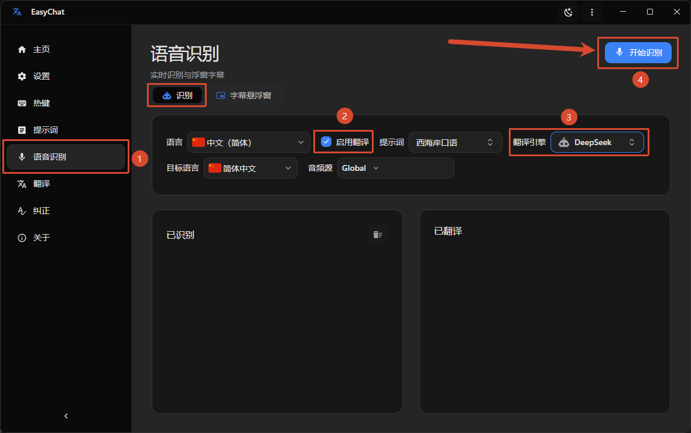
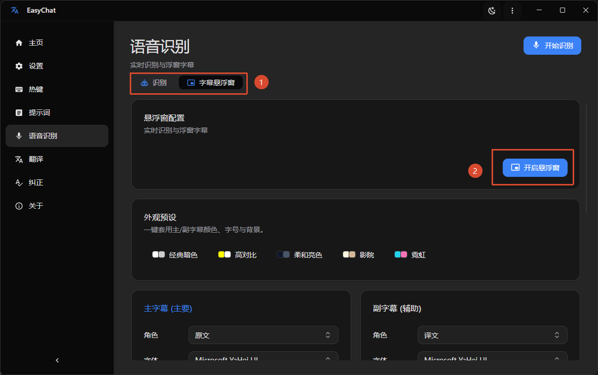

import { Cards, Card } from 'fumadocs-ui/components/card';
import { Video, Presentation, Headphones, Subtitles } from 'lucide-react';

EasyChat can recognize audio playing on your Windows system, translate it, and display the result as subtitles. Ten recognition languages are supported.

## How to use it

<Callout title="ASR model required" type="warning">
  Download an ASR model from [GitHub](https://github.com/SwaggyMacro/MicroASR/releases/tag/models-v1), [Google Drive](https://drive.google.com/drive/folders/19pmknOmBA07HiVrUQljz1Jh3t3Jy8aDF?usp=sharing), or the [EasyChat QQ group](https://qm.qq.com/q/rXrrefKXNQ). You can also use the built-in model download controls when a catalog is available.
</Callout>

1. Under `Setting > Speech > ASR models`, import the required model folder or supported model archive.
   
2. Open `Speech Recognition`, choose the audio source and recognition options, and start recognition. Enable the `Subtitle Window` to show the original text or translation over other applications.
   > The audio source can be limited to a specific process so sounds from other applications are ignored.

   
   

<VideoPlayer
  src="/videos/screenrecord-asr.mp4"
  aria-label="Live Speech Recognition example"
/>

## Use cases

<Cards>
  <Card title="Videos and live streams without subtitles" icon={<Video />}>
    Follow foreign-language videos and streams with translated subtitles generated from system audio.
  </Card>
  <Card title="International meetings and online classes" icon={<Presentation />}>
    Select the meeting application's audio process to receive focused subtitles without interference from other software.
  </Card>
  <Card title="Podcasts and audio-only content" icon={<Headphones />}>
    Turn podcasts, audiobooks, and interviews into readable translated text.
  </Card>
  <Card title="Listening practice" icon={<Subtitles />}>
    Compare spoken language with real-time source or translated subtitles while studying.
  </Card>
</Cards>
