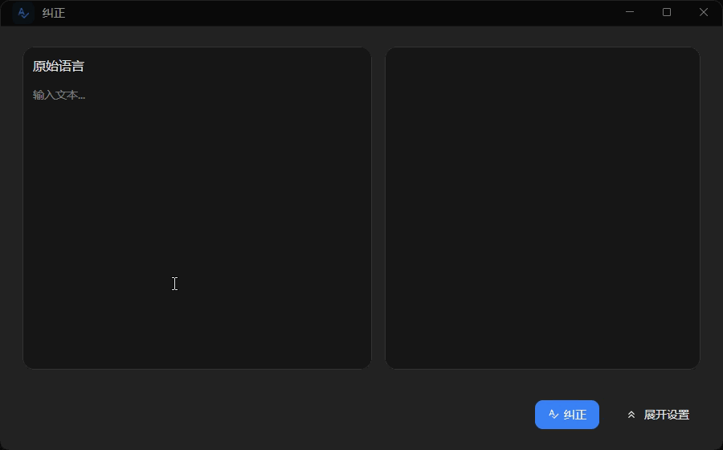

import { Cards, Card } from 'fumadocs-ui/components/card';
import { Mail, GraduationCap, FileText, CheckCircle } from 'lucide-react';

## How to use it

Use Quick Correction either from the correction tab on the `Translate / Correct` page or from a global shortcut. An AI model is required.

The page and shortcut window let you choose the source language, AI model, and prompt. EasyChat underlines detected issues, shows a corrected result, and provides suggestions and explanations.

### Shortcut

1. On the `Shortcut` page, add a shortcut for Quick Correction. Enable `Read selected text` if the shortcut should copy the current selection automatically.
2. Press the shortcut, then enter text or correct the selection loaded into the window.

## Use cases

<Cards>
  <Card title="Email and professional communication" icon={<Mail />}>
    Review a foreign-language draft for grammar and natural wording before sending it.
  </Card>
  <Card title="Grammar study" icon={<GraduationCap />}>
    Use underlined issues and detailed explanations to understand why a correction was made.
  </Card>
  <Card title="Academic and technical proofreading" icon={<FileText />}>
    Check longer passages for tense, agreement, preposition, and wording problems.
  </Card>
  <Card title="Social media drafts" icon={<CheckCircle />}>
    Review a post before publishing it in a language you are still learning.
  </Card>
</Cards>
