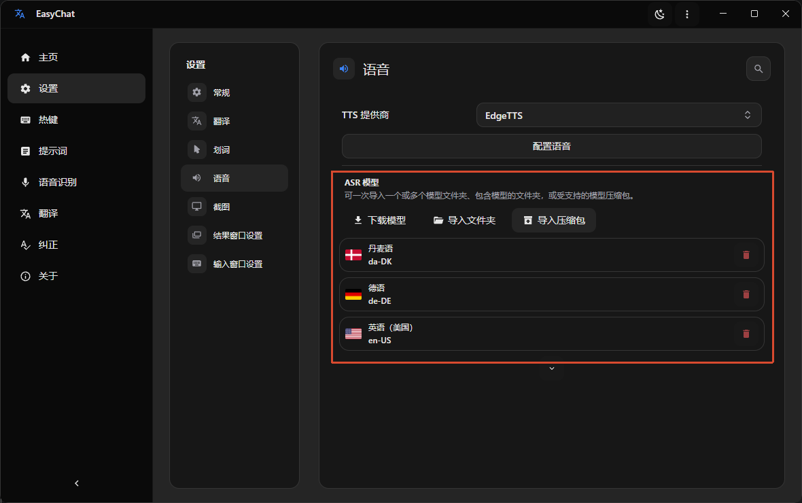

import { Cards, Card } from 'fumadocs-ui/components/card';
import { MicSignal, Speech } from 'lucide-react';

Live Translation has two modes.

<Callout title="ASR model required" type="warning">
  Before using Live Translation, [install an ASR model](./asr#install-an-asr-model). Without an ASR model, EasyChat cannot recognize speech.
</Callout>

<Cards>
  <Card title="Audio Translation" icon={<Speech />} href="./asr">
    EasyChat recognizes audio and video playing on your system, then displays the translated result as subtitles.
  </Card>

  <Card title="Live Interpretation" icon={<MicSignal />} href="./speak">
    Speak into your microphone and EasyChat recognizes, translates, and sends the result to a virtual audio device for use in other applications.
  </Card>
</Cards>

## Install an ASR model

In `Settings` -> `Speech` -> `ASR Model`, download or import the ASR model you need.

<Callout title="Download notes" type="warning">
  Users in mainland China may experience download failures because of network issues. Configure a proxy in `Settings` -> `General` -> `Network Proxy`, or use a tool such as Watt Toolkit to accelerate GitHub downloads. You can also manually import a model downloaded from [GitHub](https://github.com/SwaggyMacro/MicroASR/releases/tag/models-v1), [Google Drive](https://drive.google.com/drive/folders/19pmknOmBA07HiVrUQljz1Jh3t3Jy8aDF?usp=sharing), or the files in our [QQ Group](https://qm.qq.com/q/rXrrefKXNQ).
</Callout>

## Supported languages

Ten recognition languages are supported. Each requires its own ASR model, so download the matching model before you begin.

| Language | Code |
| --- | --- |
| English | en-US |
| Chinese (Simplified) | zh-CN |
| Japanese | ja-JP |
| Korean | ko-KR |
| German | de-DE |
| Danish | da-DK |
| Spanish | es-ES |
| French | fr-FR |
| Italian | it-IT |
| Portuguese | pt-PT |
