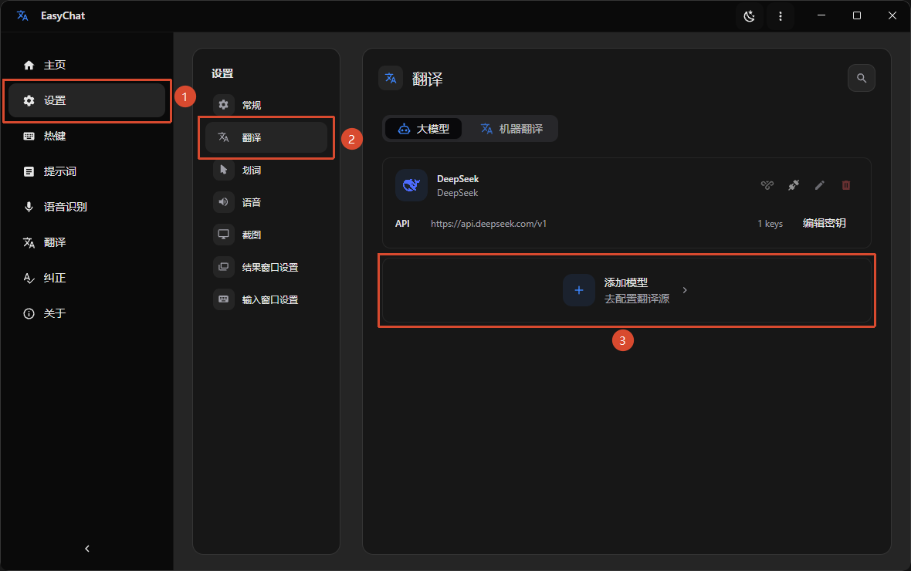
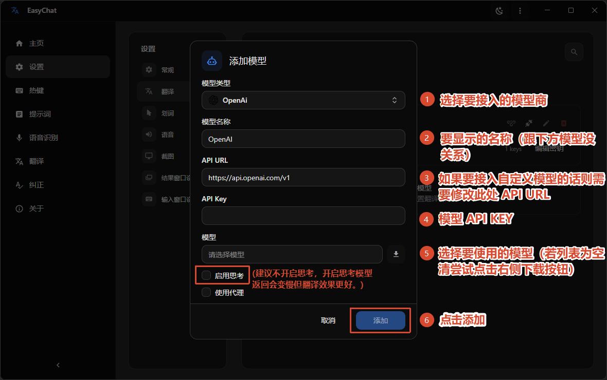
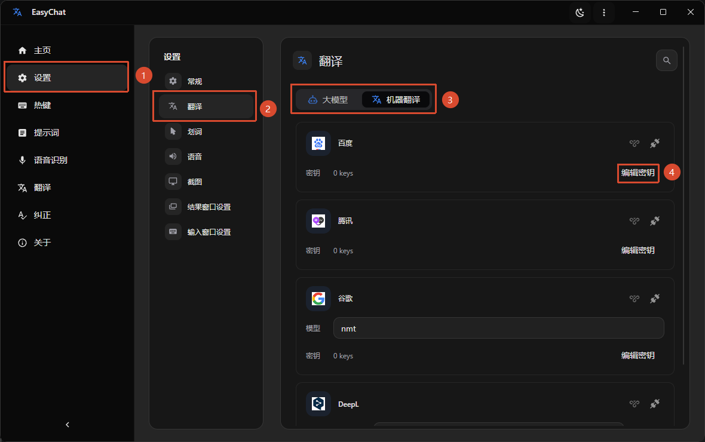
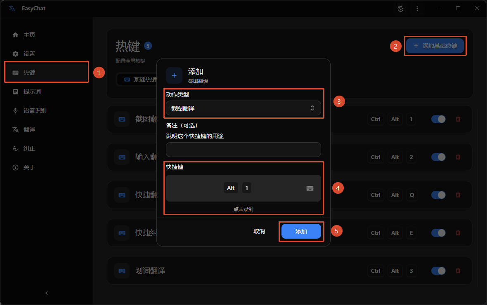
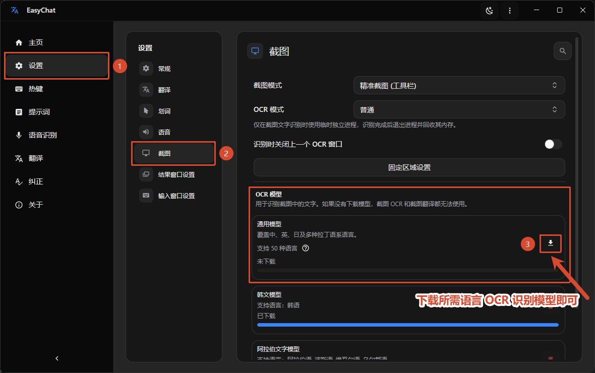
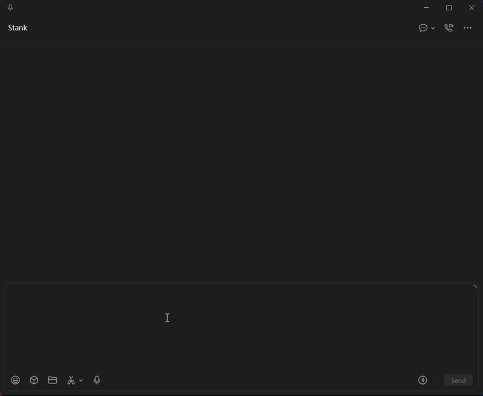

import { Step, Steps } from 'fumadocs-ui/components/steps';

<Steps>
  <Step>
    ### Step 1: Download and install EasyChat

    Follow [Download and Install](./installation) to get and install EasyChat.
  </Step>

  <Step>
    ### Step 2: Configure a translation source

    EasyChat supports both AI models and machine translation. Choose one based on your needs. See [Translation Sources](./engine) for a comparison.

    #### AI model

    1. Open EasyChat and select `Setting` in the sidebar.
    2. Select `Translation` on the settings page.
    3. On the `AI Model` tab, add and configure the model you want to use.
    
    4. Select `Save` to keep the configuration.
    

    #### Machine translation

    1. Open EasyChat and select `Setting` in the sidebar.
    2. Select `Translation` on the settings page.
    3. On the `Machine Trans` tab, enter the API key for the translation service you want to use.
    
  </Step>

  <Step>
    ### Step 3: Configure shortcuts

    1. Open the `Shortcut` page from the EasyChat sidebar.
    2. Add shortcuts for the actions you want to use.
    3. For example, bind screenshot translation to `Alt` + `1` and `Typing Translate` to `Alt` + `2`.
    
  </Step>

  <Step>
    ### Step 4: Download an OCR model

    EasyChat uses OCR models to recognize text in screenshots.

    1. Open EasyChat and select `Setting` in the sidebar.
    2. Select `Screenshot` on the settings page.
    3. Choose the OCR language model you need, then select `Download`.
    
  </Step>
</Steps>

## Start using EasyChat

You can now use screenshot translation and Typing Translate:

1. **Screenshot translation:** Press `Alt` + `1`, then select the area to translate. EasyChat recognizes and translates it automatically.
2. **Typing Translate:** Focus a text field in an application such as a chat client or browser, press `Alt` + `2`, and enter the text in the window that appears. EasyChat detects the language, translates the text, and sends the result to the target application.

