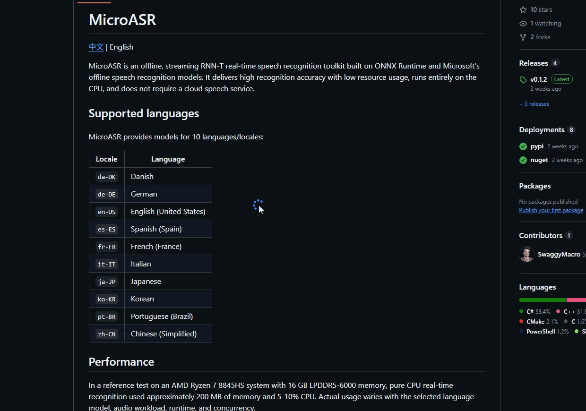

import { Cards, Card } from 'fumadocs-ui/components/card';
import { ScanText, MousePointerClick, Code, Search } from 'lucide-react';

## 功能介绍
图片取词功能可以让用户在截图后针对图片上的所有文字进行选择操作，支持翻译、复制、解释以及图片翻译等功能。用户可以通过截图框选的方式自动识别图片中的文字，并支持选择任意区域的文字进行操作。

## 使用方法

图片取词有两种方式

### 热键

在 `热键` 中添加一个新的 `截图 OCR` 热键，设置好热键后，按下热键即可进入截图取词模式。

### 截图工具栏
在 `设置`->`截图`->`截图模式` 中选择 `精确截图(工具栏)`，在截图翻译热键按下选取区域后，截图工具栏会自动弹出，点击 `OCR` 按钮即可进入截图 OCR 模式。

## 使用场景

<Cards>
  <Card title="提取不可复制文本" icon={<ScanText />}>
    遇到系统弹出的报错弹窗、禁止复制的网页、加密 PDF 或是纯图片格式的扫描件时，只需轻松一截，即可将图片中的特定错误代码或段落提取并复制出来，彻底告别手动敲字的烦恼。
  </Card>

  <Card title="图片内文字精准查词" icon={<MousePointerClick />}>
    阅读海外漫画、设计海报或游玩外文游戏时，不想使用全屏翻译破坏原图排版？通过该功能，你可以像在浏览器中一样，精准使用鼠标划选图片中某个不认识的生词或短语，单独调用“解释”或“翻译”。
  </Card>

  <Card title="视频教程代码与数据提取" icon={<Code />}>
    观看 YouTube 编程教学、数据分析讲座或软件操作教程时，遇到讲师屏幕上的长段代码或表格数据，直接截图取词，选中所需部分一键复制，快速在自己的编辑器或 Excel 中进行测试与应用。
  </Card>

  <Card title="关键信息快速检索与流转" icon={<Search />}>
    收到同事发来的截图（如聊天记录截图、报错截图）或看到社交媒体上的海报时，利用图片取词快速选中关键信息（如快递单号、特定术语、地址、联系方式等）并复制，迅速粘贴到其他应用中进行搜索和处理。
  </Card>
</Cards>