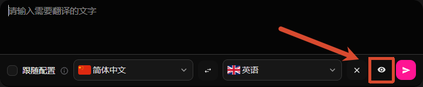
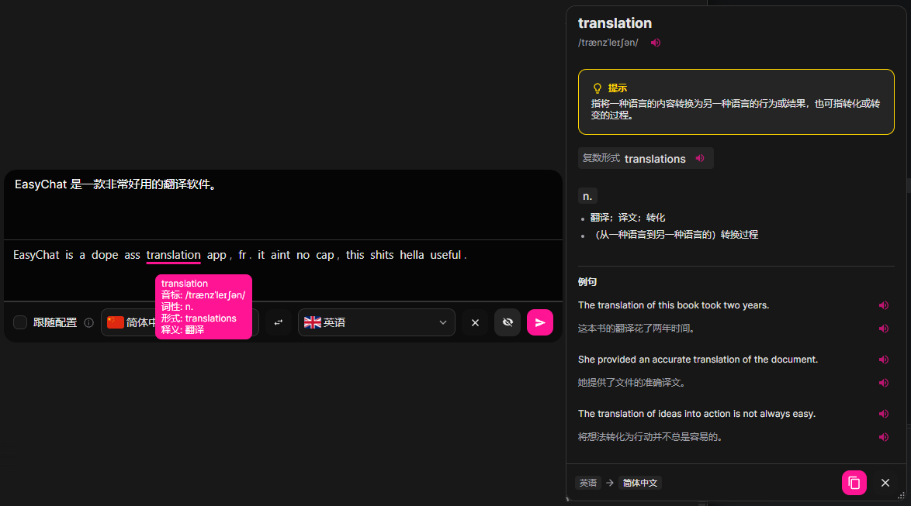

import { Cards, Card } from 'fumadocs-ui/components/card';
import { Briefcase, Headset, Gamepad2, MessageCircle, Globe } from 'lucide-react';

输入翻译功能支持用户在按下热键后，直接输入中文或其他语言，EasyChat 将自动识别并翻译为目标语言，并将翻译后的文本投递到目标应用中。

## 使用方法
1. 添加快捷键
    在软件主界面左侧菜单点击 `热键` 按钮，添加输入翻译的快捷键。
2. 输入翻译
    按下设置好的快捷键后，即可体验输入翻译功能。

## 相关设置
输入窗口中支持：
1. 设置源语言和目标语言，或选择 `跟随配置` 选项，EasyChat 将自动使用您配置的源语言和目标语言。
2. 支持预览功能，在输入窗口右下角关闭按钮旁边的眼睛图标，点击后可预览翻译结果。

<Callout title="注意" type="warning">
    预览效果支持每个单词鼠标悬浮显示释义(仅翻译源为 AI 大模型时可用)，以及点击跳转词典。
    
</Callout>

## 注意事项
1. 您需要先配置至少一个可用的翻译源（AI 大模型或机器翻译），才能使用输入翻译功能。
2. 输入翻译窗口支持修改语言，您可以在输入翻译窗口中选择源语言和目标语言，或选择 `跟随配置` 选项，EasyChat 将自动使用您配置的源语言和目标语言。

## 使用场景

<Cards>
  <Card title="跨国商务与团队协作" icon={<Briefcase />}>
    在与海外客户或跨国团队使用 Slack、Teams 或邮件沟通时，无需频繁在翻译软件和聊天窗口间来回切换。按下热键直接输入母语，EasyChat 会自动将准确的外语投递到输入框，大幅提升跨语种办公效率。
  </Card>

  <Card title="跨境电商客服回复" icon={<Headset />}>
    面对来自全球不同国家的买家咨询，客服可以直接在 WhatsApp、Skype 或电商平台后台输入中文。系统会精准将其转化为买家的本地语言并直接发送，打破语言壁垒，提升客户体验和响应速度。
  </Card>

  <Card title="国际服游戏实时交流" icon={<Gamepad2 />}>
    在游玩国际服游戏时，战局瞬息万变。通过热键呼出输入框，用中文快速指挥或闲聊，游戏频道内会自动输出目标外语，让你与全球队友无缝配合，告别“拼音交流”。
  </Card>

  <Card title="海外社交与日常交友" icon={<MessageCircle />}>
    在使用 Telegram、Discord、Line 等社交软件结交国际友人时，该功能可以让你毫无压力地进行深度交流。即使不懂对方的语言，也能像使用母语一样流畅自如地表达情绪与想法。
  </Card>

  <Card title="多语种内容快捷发布" icon={<Globe />}>
    运营海外社交媒体（如 Twitter、Instagram、Reddit）时，创作者可直接输入中文灵感或文案，一键将其翻译并直接投递到发布框中，轻松完成多语种内容的快速输出与排版。
  </Card>
</Cards>