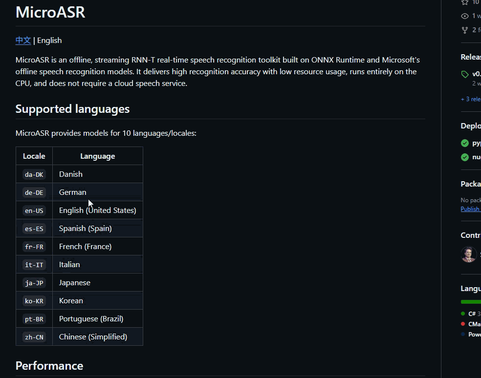

import { Cards, Card } from 'fumadocs-ui/components/card';
import { Zap, BookOpen, PenLine, Layers } from 'lucide-react';

## 如何使用
快捷翻译有两种使用方式，一种是添加快捷翻译热键，一种则是在软件主界面的翻译页面中直接使用。

> 用户可在 `快捷翻译` 页面中设置目标语言、翻译引擎、是否显示详解注释等配置项，设置区域可在窗口右下角的 `展开设置` 按钮进行展开和收起。

### 快捷键
1. 在 `热键` 中添加一个新的 `快捷翻译` 热键，设置好热键后，按下热键即可进入快捷翻译模式。
   热键支持设置 `读取选中文本` 功能，在按下快捷键后会自动获取鼠标选中的文本进行翻译。
2. 按下快捷键后，即可弹出快捷翻译窗口，用户可以直接输入文本进行翻译，或者在设置了 `读取选中文本` 功能的情况下，直接获取鼠标选中的文本进行翻译。

## 使用场景

<Cards>
  <Card title="跨应用无缝查词与翻译" icon={<Zap />}>
    在浏览网页、阅读 PDF、查看代码或使用任何其他软件时，只需选中不认识的词汇或段落，按下快捷键（配合“读取选中文本”功能）即可瞬间弹出翻译结果。无需打断当前工作流去切换翻译软件，实现真正的“所见即所译”。
  </Card>

  <Card title="深度外语学习与词汇拓展" icon={<BookOpen />}>
    不仅仅是简单的字面翻译。当你在快捷窗口输入单个生词时，丰富的词典详情会为你提供词汇搭配、罕见词用法、重点词标记及语法建议。非常适合备考或日常积累，让每一次查词都变成一次深度的知识拓展。
  </Card>

  <Card title="辅助外文写作与精准表达" icon={<PenLine />}>
    在撰写外语邮件、论文草稿或社交媒体动态时，如果突然忘记某个词汇或不知如何表达更地道，可以随时呼出快捷翻译输入中文。通过参考详细的用法建议和多维度的释义，确保最终写出的外文精准且专业。
  </Card>

  <Card title="多语言办公极速响应台" icon={<Layers />}>
    对于需要频繁处理多语种信息的商务或客服人员，可以将软件主界面的翻译页面作为高效的中央文本处理台。随时手动输入或粘贴大段文字进行快速转换，轻松应对高强度的跨语言工作需求。
  </Card>
</Cards>