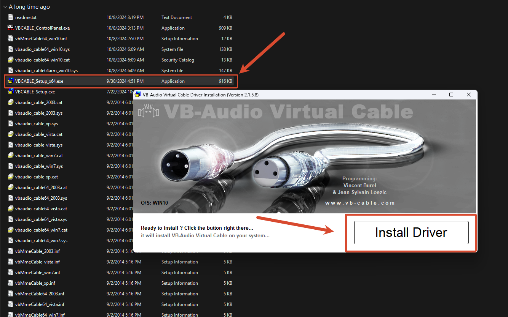
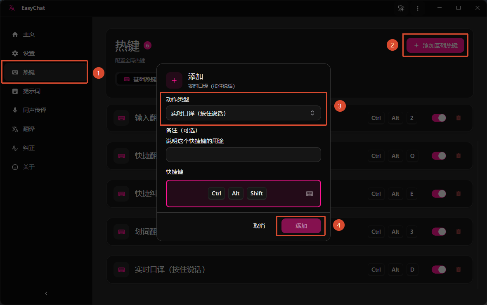
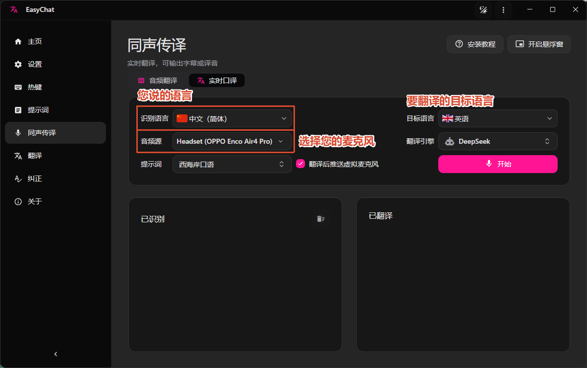

import { Apple, Grid2x2 } from 'lucide-react';

## 前提条件
使用实时口译功能，需要您先安装 ASR 模型，并安装虚拟音频驱动。
- ASR 模型: 实现语音识别的核心组件，支持 10 种语言的识别。
- 虚拟音频驱动: 将 EasyChat 的翻译结果输出为虚拟麦克风设备，供其他软件使用，实现同声传译的效果。

### 安装 ASR 模型
在使用实时口译功能前，请确保已[安装 ASR 模型](./asr#安装-asr-模型)。

### 安装虚拟音频驱动
EasyChat 使用 [VB-CABLE](https://vb-audio.com/Cable/) 作为虚拟音频驱动。  

#### Windows 用户
<Callout title="Windows 驱动" type="warning" icon={<Grid2x2 />}>
    Windows 虚拟驱动下载链接: [VB-CABLE](https://download.vb-audio.com/Download_CABLE/VBCABLE_Driver_Pack45.zip)  
</Callout>
#### macOS 用户
<Callout title="macOS 驱动" type="warning" icon={<Apple />}>
    macOS 虚拟驱动下载链接: [VB-CABLE](https://download.vb-audio.com/Download_CABLE/VBCABLE_MAC.zip)
</Callout>

下载驱动压缩包后解压缩，双击 `VBCABLE_Setup_x64.exe` 打开驱动安装程序，点击 `Install Driver` 按钮安装驱动即可。 

## 使用方法
1. 在 `热键` 页面中添加一个 `实时口译` 热键。

2. 在 `同声传译`->`实时口译` 页面中选择好配置项，选择你的真实麦克风，以及你要说的语种（识别语言），点击 `开始` 按钮。

3. 在需要使用 `实时口译` 的软件中，将麦克风输入设备设置为 `CABLE Output`，即可使用实时口译功能。
> 或者直接在系统的 `设置`->`声音`->`输入` 中将麦克风输入设备设置为 `CABLE Output`，即可在所有软件中使用实时口译功能。

现在按住热键对麦克风说话，EasyChat 将自动识别说话内容并翻译为目标语言通过虚拟音频设备输出，达到同声传译的效果。

<Callout title="注意" type="warning">
    按住热键时，软件会发出 `Beep` 声音提示，表示正在识别语音；  
    松开热键时，软件会发出 `Beep` 声音提示，表示识别结束。   
    翻译完成后，软件会发出 `Beep` 声音提示，表示翻译完成。  
    总共有三种 `Beep` 声音提示，分别表示识别开始、识别结束、翻译完成。  
    > 翻译完成后就会进行 TTS 语音合成（大概1~3秒），并通过虚拟音频设备输出翻译结果。
</Callout>