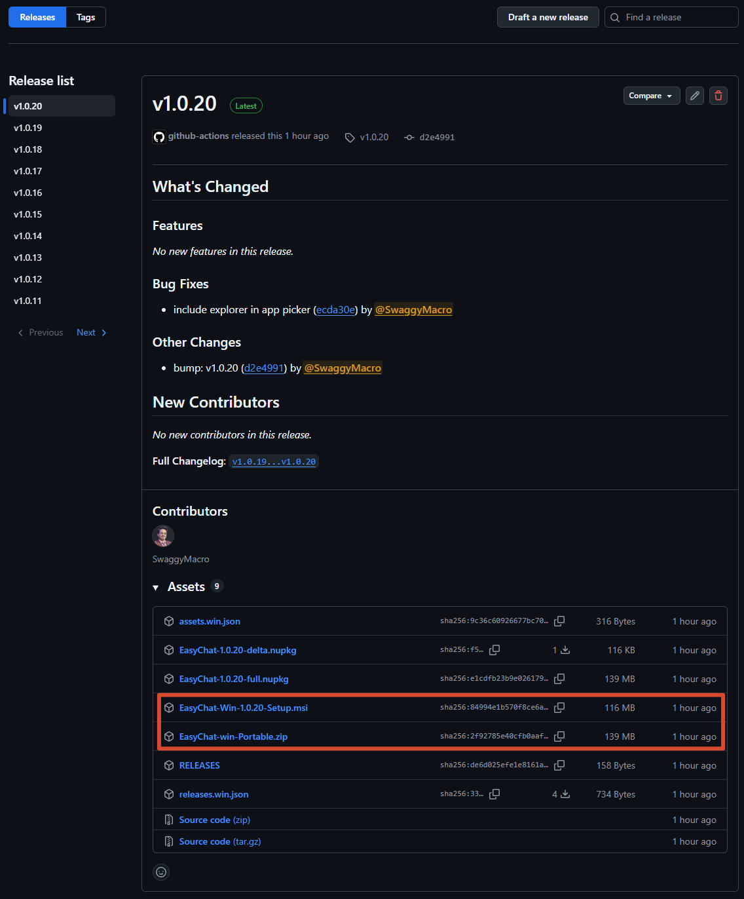

## 下载
访问 [Github 发布页](https://github.com/SwaggyMacro/EasyChat/releases) 下载最新版本的 EasyChat。选择适合您操作系统的安装包进行下载。
<Callout type="info" title="Windows 支持">
  EasyChat 当前仅支持 Windows，
  macOS 和 Linux 兼容计划正在推进中。
</Callout>

## 安装方式

### 安装包
提供安装包，您可以下载并运行安装程序来安装 EasyChat。
> 推荐使用安装包进行安装，以便在系统中创建快捷方式。
名称为: `EasyChat-Win-<version>-Setup.msi` 的安装包。

### 便携版
提供了便携版的 EasyChat，您可以直接解压缩后运行，无需安装。
便携版的文件名为: `EasyChat-Win-<version>-Portable.zip`。
解压后运行 `EasyChat.exe` 即可启动软件。

